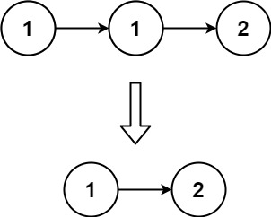

# Single Number
[LeetCode](https://leetcode.com/problems/single-number/)

## Problem Description

Given a non-empty array of integers nums, every element appears twice except for one. Find that single one.

You must implement a solution with a linear runtime complexity and use only constant extra space.

 
## Example & constraints
Example 1:
```
Input: nums = [2,2,1]

Output: 1
```
Example 2:
```
Input: nums = [4,1,2,1,2]

Output: 4
```
Example 3:
```
Input: nums = [1]

Output: 1
```
Constraints:

1. 1 <= nums.length <= 3 * 104
2. -3 * 104 <= nums[i] <= 3 * 104
3. Each element in the array appears twice except for one element which appears only once.

## Solution
```cpp 
//0ms solution
class Solution {
public:
    int singleNumber(vector<int>& nums) {
        int ans = 0;
        for(auto&c:nums){
            ans = ans ^ c;
        }
        return ans;
    }
};
``` 
```cpp
//13ms solution
class Solution {
public:
    int singleNumber(vector<int>& nums) {
        map<int,int> freq;
        for(auto&c:nums)freq[c]++;
        for(auto&c:freq){
            if(c.second==1)return c.first;
        }
        return 0;
    }
};
```
## Explanation
*   **13ms 版本**  
    一開始我是寫出 13ms 的版本，比較符合直覺，先計數再找出只出現一次的數字。因為 `map` 通常用來實作紅黑樹，這樣的情況下整體時間複雜度是 $O(n \log n)$，能解但不快。

*   **0ms 版本 (Bit Manipulation)**  
    0ms 的版本是用位元運算，因為 `Xor` 的真值表是這樣的：  
      
    > Resource: [Xor truth table](https://beletronics.wordpress.com/2-6-xor-and-xnor/)

    運用 XOR 的以下性質 (其中 $\oplus$ 代表 XOR)：
    *   $0 \oplus A = A$
    *   $A \oplus A = 0$
    *   $A \oplus B = B \oplus A$
    *   $A \oplus (B \oplus C) = (A \oplus B) \oplus C$

    這代表你的數字順序根本沒差，因為重複的都會為 0 ($A \oplus A = 0$)，剩下的數字就是只出現一次的數字。

## Complexity
*   **Time Complexity:** $O(n)$
*   **Space Complexity:** $O(1)$ 