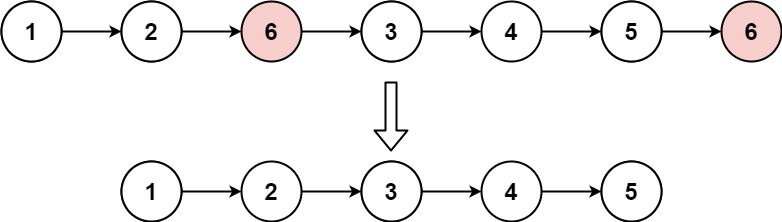

# Remove Linked List Elements
[LeetCode](https://leetcode.com/problems/remove-linked-list-elements/)

## Problem Description

Given the head of a linked list and an integer val, remove all the nodes of the linked list that has Node.val == val, and return the new head.

## Example & Constraints

Example 1:



* resource from LeetCode:
[https://leetcode.com/problems/remove-linked-list-elements](https://leetcode.com/problems/remove-linked-list-elements)

```
Input: head = [1,2,6,3,4,5,6], val = 6
Output: [1,2,3,4,5]
```
Example 2:
```
Input: head = [], val = 1
Output: []
```
Example 3:
```
Input: head = [7,7,7,7], val = 7
Output: []
```

**Constraints**

* The number of nodes in the list is in the range [0, $10^4$].
* 1 <= Node.val <= 50
* 0 <= val <= 50

## Solution
```cpp
/**
 * Definition for singly-linked list.
 * struct ListNode {
 *     int val;
 *     ListNode *next;
 *     ListNode() : val(0), next(nullptr) {}
 *     ListNode(int x) : val(x), next(nullptr) {}
 *     ListNode(int x, ListNode *next) : val(x), next(next) {}
 * };
 */
class Solution {
public:
    ListNode* removeElements(ListNode* head, int val) {
        ListNode dummy(0,head);
        ListNode* prev = &dummy;
        ListNode* curr = head;
        while(curr!=NULL){
            if(curr->val == val){
                prev->next = curr->next;
                delete(curr);
                curr = prev->next;
            }
            else{
                prev = curr;
                curr = curr->next;
            }
        }
        return dummy.next;
    }
};
```

## Explanation
### Solution Analysis

這題可以拆分成多個區塊
* remove from head: 
    * 通常會使用dummy node來處理，避免移動head的同時，把整個linked list弄不見，並且dummy node不耗記憶體，是一個挺方便的方式
    * 當我們在處理head == val 的情況時，我們需要將head指向下一個node，並且將原本的head delete掉，所以會做一個dummy node 充當prev，接著處理方式就一樣，dummy node 接到原本head 的下一個位置，並且將原本的head delete掉，接著將curr 指向原本head 的下一個位置，這樣前後就都接上了
* remove from middle
    * 當我們在處理middle == val 的情況時，我們需要將prev->next 指向curr->next，並且將curr delete掉，接著將curr 指向prev->next，這樣前後就都接上了
* remove from tail
    * 當我們在處理tail == val 的情況時，我們需要將prev->next 指向curr->next，並且將curr delete掉，接著將curr 指向prev->next，這樣前後就都接上了

* 其實動作都相同，只有開頭比較不同，要注意指標的移動


## Complexity
*   **Time Complexity:** $O(n)$
*   **Space Complexity:** $O(1)$
