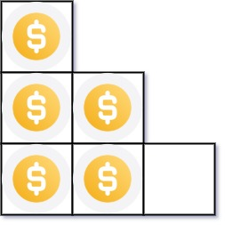
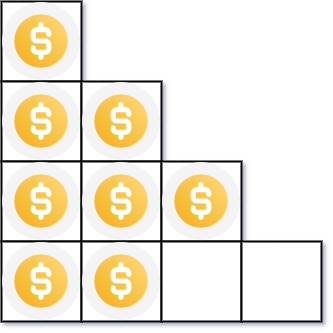

# Arranging Coins

[LeetCode](https://leetcode.com/problems/arranging-coins/)

## Problem Description

You have n coins and you want to build a staircase with these coins. The staircase consists of k rows where the ith row has exactly i coins. The last row of the staircase may be incomplete.

Given the integer n, return the number of complete rows of the staircase you will build.

 
## Example & constraints
Example 1: <br>

 <br>
resource: [LeetCode](https://leetcode.com/problems/arranging-coins/)<br>
```
Input: n = 5 <br>
Output: 2 <br>
```
Explanation: Because the 3rd row is incomplete, we return 2. <br>

Example 2: <br>

resource: [LeetCode](https://leetcode.com/problems/arranging-coins/)<br>
```
Input: n = 8
Output: 3
```
Explanation: Because the 4th row is incomplete, we return 3.
 

Constraints:

1 <= n <= $2^{31} - 1$
## Solution
```cpp
class Solution {
public:
    int arrangeCoins(int n) {
        long long int left = 1,right = n;
        while(left <= right){
            long long int mid = left + (right-left)/2;
            long long int tot = ((1+mid)*mid)/2;
            if(tot < n){
                left = mid + 1;
            }
            else if(tot > n){
                right = mid - 1;
            }
            else{
                return mid;
            }
        }
        return right;

    }
};
```

## Explanation
*  這題可以用二分搜來解的原因是，每一層是線性遞增，所以總數也是線性遞增，上下限為1到n，然後找答案，如果總數大於n，上界就要調整，反之，調整下界。
*  每次遇到這類題目我都會想用`recursion`解看看，但每次都會overflow，但這題可以用，但非常慢，最差的情形就是$n = 2^{31}-1$，所以可以的話，還是想個有效率的方法。
  
## Time Complexity
*   $O(log n)$
## Space Complexity
*   $O(1)$


